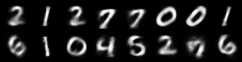
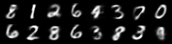

# CapsNet Guide in PyTorch


[](https://opensource.org/licenses/Apache-2.0)

This is my PyTorch implementation of the CapsNet in Hinton's paper [Dynamic Routing Between Capsules](https://arxiv.org/abs/1710.09829). I try to implement it in a style that help newcomers understand the architecture of CapsNet and the idea of Capsules. Therefore I am not going to wrap the codes into capsule layer APIs, and I more oftenly declare constants rather than passing parameters to functions, neither are the codes optimized for speed. The classes and functions are supplemented with detailed comments, so to read and understand the codes, simply start from the comments in `main.py` and follow the order list at the head of the file.

As I am busy these days, I might not have time to checkout and fix every issue. But contributions are highly welcomed. If you find any bugs or errors in the codes, please do not hesitate to open an issue or a pull request.

## Requirements

- pytorch 0.2.0
- torchvision
- pytorch-extras 
- tensorboard-pytorch
- tqdm

All codes are tested under Python 3.6.3.

## Get Started

After cloning the repository, simply run the command:

```bash
python main.py
```

The codes will automatically download the MNIST dataset (if not exist) into `./data` and start traing and testing. Tensorboard logs are automatically saved in `./runs`, and model checkpoints are saved in `./ckpt` by default.

Default parameters are defined in `get_opts()` in `utils.py`, which are listed below and can be changed by passing arguments. (e.g. `python main.py -batch_size 128 -epochs 30`)

```bash
-batch_size     64      # Data batch size for training and testing
-lr             1e-3    # Learning rate
-epochs         10      # Train epochs
-r              3       # Number of iterations of for Dynamic Routing
-use_cuda       True    # Use GPU
-print_every    10      # Interval of batches to print out losses
```

Based on my own experiments, one train epoch takes about 6 minutes on a GTX 1080Ti with default settings. (I set 10 epochs as default just for showcasing, you should try 30 or more.)

## Results

I have not fine tuned the parameters, results below are obtained with the default configurations in the codes. You can find this Tensorboard log in `./runs/sample/`. Please do make a pull request if you find out the best parameters :)

### Train 


### Test


### Reconstructed images








## Reference

[1] Sabour, Sara, Nicholas Frosst, and Geoffrey E. Hinton. "Dynamic Routing Between Capsules." arXiv preprint arXiv:1710.09829 (2017).
