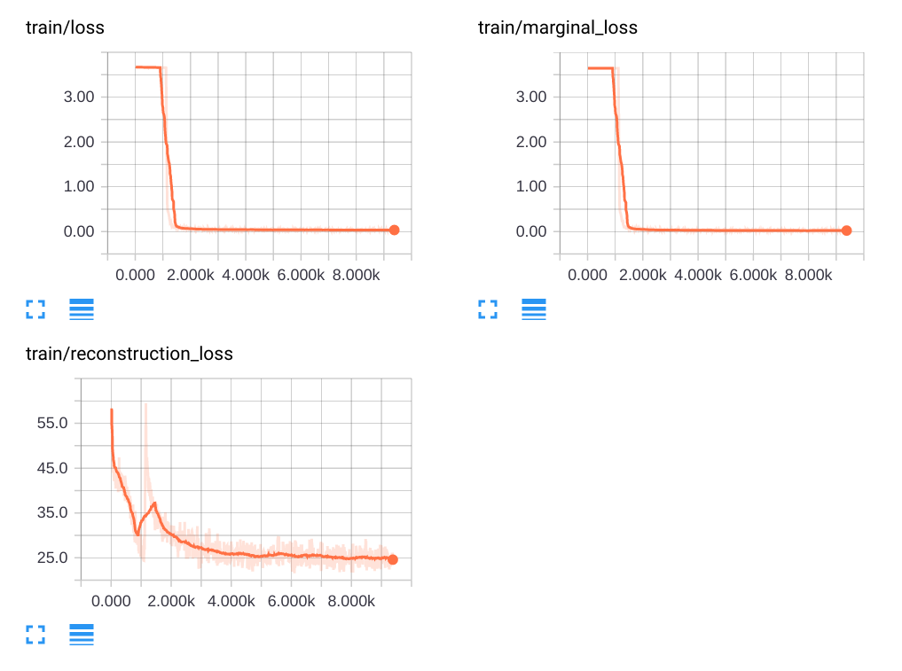
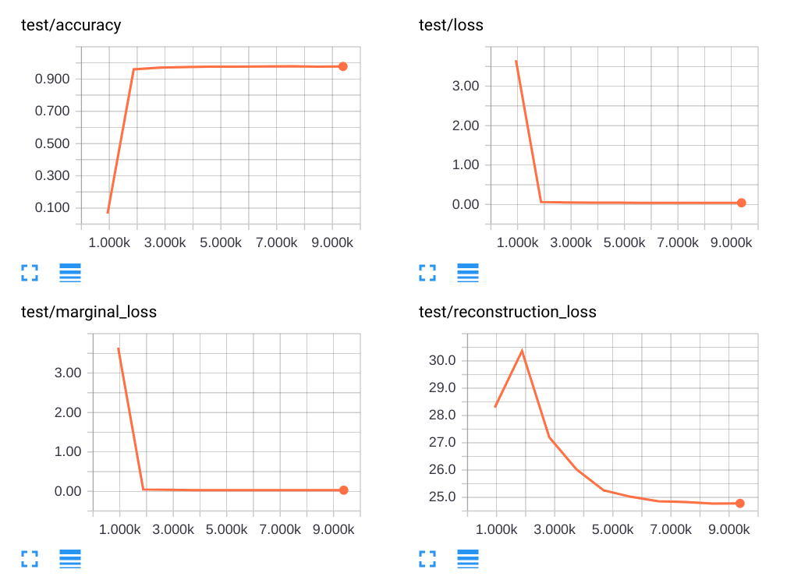

# CapsNet Guide in PyTorch


[](https://opensource.org/licenses/Apache-2.0)

This is my PyTorch implementation of the CapsNet in Hinton's paper [Matrix Capsules with EM Routing](https://openreview.net/pdf?id=HJWLfGWRb). EM-Routing method is added and the code is refactorized. Unlike the tutorial-version on branch master, this optimized version will focus more on execution speed and memory allocation.

## TODOs

- SmallNORB Datasets
- Training and Test Results
- Hyper-Parameters Tuning
- Routing Visualization
- Adversarial Robustness
- Cython Extension

## Requirements

- pytorch 0.4.0
- torchvision
- pytorch-extras (For one-hot vector conversion)
- tensorboard-pytorch
- tqdm

All codes are tested under Python 3.6.

## Get Started

After cloning the repository, simply run the command:

```bash
python main.py
```

The codes will automatically download the MNIST dataset (if not exist) into `./data` and start traing and testing. Tensorboard logs are automatically saved in `./runs`, and model checkpoints are saved in `./ckpt` by default.

Default parameters are defined in `get_opts()` in `utils.py`, which are listed below and can be changed by passing arguments. (e.g. `python main.py -batch_size 128 -epochs 30`)

```bash
-batch_size     64      # Data batch size for training and testing
-lr             1e-3    # Learning rate
-epochs         10      # Train epochs
-r              3       # Number of iterations of for Dynamic Routing
-use_cuda       True    # Use GPU
-print_every    10      # Interval of batches to print out losses
```

Based on my own experiments, one train epoch takes about 6 minutes on a GTX 1080Ti with default settings. (I set 10 epochs as default just for showcasing, you should try 30 or more.)

## Results

I have not fine tuned the parameters, results below are obtained with the default configurations in the codes. You can find this Tensorboard log in `./runs/sample/`. Please do make a pull request if you find out the best parameters :)

### Train



### Test



### Routing Visualization
To be updated

### Adversarial Robustness
To be updated

## Reference

[1] Geoffrey Hinton, Nicholas Frosst, and Sara Sabour. Matrix capsules with em routing. ICLR,
2018.
